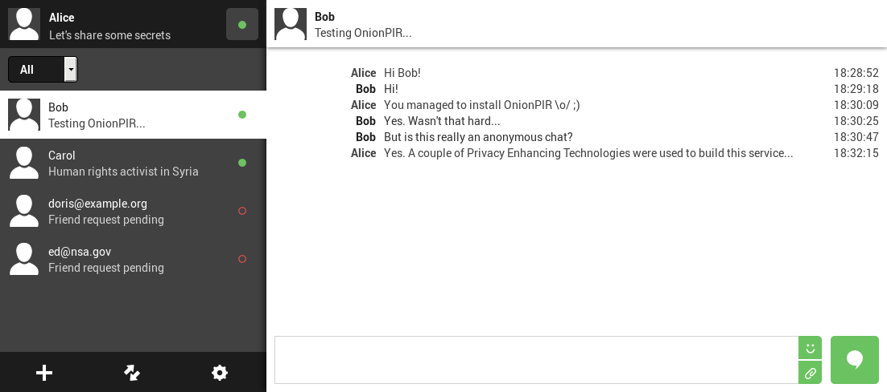

# OnionPIR
OnionPIR is an anonymous communication service that allows private communication
without revealing the users social graphs to the server. OnionPIR is based on
RAID-PIR and Tor and consists of the OnionPIR server, the servers from the
RAID-PIR library and the OnionPIR client.

**Warning:** This code is **not** meant to be used for a productive environment
and is intended for testing and demonstration purposes only.



## Requirements
In addition to the requirements of RAID-PIR, the following libraries and tools
need to be installed on the host system:
- [PyNaCl](https://github.com/pyca/pynacl) `pip install pynacl`
- [Tor](http://torproject.org/) `apt-get install tor `
- [Stem](https://stem.torproject.org/) `pip install stem`
- [CherryPy](http://cherrypy.org/) `pip install cherrypy`
- [WebSocket for Python](https://github.com/Lawouach/WebSocket-for-Python) `pip install ws4py`

## Deployment
OnionPIR comes with a number of scripts that can be used to simplify deployment.
It is assumed that RAID-PIR is placed under `./raidpir/`.

To have fast XOR operations, you'll need to build some C code. To do this you
have to run `python setup.py build` from within the raidpir directory.


### OnionPIR server
The OnionPIR server handles user registrations and serves as the content
provider for the RAID-PIR servers.

The OnionPIR server can be started by running `onionpir_server.py` from within
the OnionPIR directory:

```
onionpir> ./onionpir_server.py
Server public key: 4de92f212b8bd70c89b6eeb74f8d0413982fb40e69d9502b35635c57e681dd18
Starting server at 0.0.0.0:8900
```

It is important that the OnionPIR is reachable via a public IP address, even in
a test scenario on a single machine because Tor nodes have to be able to
establish a connection from outside the local network (unless disabling onion
routing for testing purposes (see section 'OnionPIR client')).

### RAID-PIR vendor
Next, the RAID-PIR vendor has to be started:

```
onionpir/raidpir> ./raidpir_vendor.py -m ../server_manifest.raw
RAID-PIR Vendor v0.9.4
Vendor Server started at 0.0.0.0 : 8901
Manifest contains 33 files in 3093 blocks of size 4096 B
```

### RAID-PIR mirrors
PIR mirrors can be deployed as normal with the help of the scripts `mirror0.sh`
and `mirror1.sh`. Since data is fetched via `rsync`, the mirrors have to be
provided with the necessary permissions to retrieve the files from the vendor
via ssh (unless deploying in a single-server test environment).

```
onionpir> ./mirror0.sh
RAID-PIR mirror v0.9.4
Using RAM datastore
Loading data into RAM datastore...
Preprocessing data...
Preprocessing done. Took 0.021654 seconds.
Datastore initialized. Took 0.163844 seconds.
Mirror Server started at 123.456.78.9 : 8903
```

Please proceed with the second RAID-PIR mirror (`mirror1.sh`) in the same way.

### OnionPIR client
OnionPIR clients provide the user interface to the OnionPIR system. Here, we
implemented the users interface as a web application. The OnionPIR client
provides a REST API and also comminicates with the OnionPIR server and the
RAID-PIR mirrors.

A client may be stated by running `onionpir_client.py` where `--port` specifies
the local port of the webserver serving the user interface, `--server_pk`
specifies the public key generated and shown by `onionpir_server.py` and
`--reg_host`/`--reg_port` specify how to reach the OnionPIR server. The config
file `client1.yaml` is used to read/store the login credentials of the client
and will be generated if it does not exist.

```
onionpir> ./onionpir_client.py --config client1.yaml --port 8080 --server_pk c7d46db8ec95178d0f7729ccfd2e265067712eb657dadc61fe25b8a07e826920 --reg_port 8900 --reg_host 123.45.67.89
Tor is already running...
Registration server: onionpir://localhost:8900
Starting the webserver...
[15/Oct/2016:13:54:33] ENGINE Bus STARTING
[15/Oct/2016:13:54:33] ENGINE Starting WebSocket processing
[15/Oct/2016:13:54:33] ENGINE Serving on http://127.0.0.1:8080
[15/Oct/2016:13:54:33] ENGINE Bus STARTED
```

Optionally, for testing purposes only, onion routing can be disabled by using
the commandline parameter `--disable-onion-routing`.

In order to chat with two different clients, please start another instance:

```
onionpir> ./onionpir_client.py --config client2.yaml --port 8081 --server_pk c7d46db8ec95178d0f7729ccfd2e265067712eb657dadc61fe25b8a07e826920 --reg_port 8900 --reg_host 123.45.67.89
Tor is already running...
Registration server: onionpir://localhost:8900
Starting the webserver...
[15/Oct/2016:13:54:33] ENGINE Bus STARTING
[15/Oct/2016:13:54:33] ENGINE Starting WebSocket processing
[15/Oct/2016:13:54:33] ENGINE Serving on http://127.0.0.1:8081
[15/Oct/2016:13:54:33] ENGINE Bus STARTED
```

### Starting a conversation
Once all services are running, the clients can be accessed via the URLs shown
when executing `onionpir_client.py` (http://127.0.0.1:8080 and
http://127.0.0.1:8081 in our case). On the registration page, arbitrary mail
addresses can be used since for our demo application no real mails are sent.
Instead, the tokens needed to complete the registration process are displayed by
`onionpir_server.py` via standard output (stdout).

After the registration process is completed for both accounts, mutally add the
users as friends of each other and start chatting.

# License
This program is free software: you can redistribute it and/or modify it under
the terms of the GNU Affero General Public License as published by the Free
Software Foundation, either version 3 of the License, or (at your option) any
later version.
